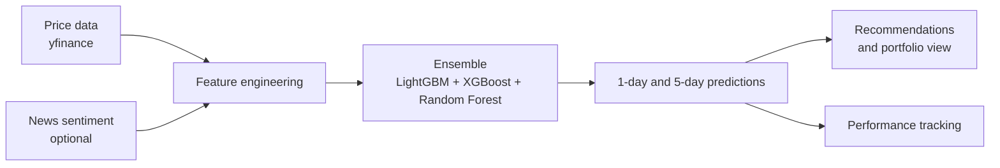

# Stock Market Predictor

An automated pipeline that pulls market data, builds features, trains an ensemble of models, and produces daily stock recommendations. It predicts 1-day and 5-day price movement for a universe of stocks and tracks its own performance over time.

> **Not financial advice.** This is a learning and engineering project. Predictions are experimental and nothing here is a recommendation to buy or sell anything.

## How it works



## Features

- **Data:** daily prices from Yahoo Finance for a configurable stock universe, going back to 2017
- **Feature engineering:** returns, moving averages, volatility, volume, momentum, liquidity, mean-reversion signals, and market-regime features based on SPY
- **News sentiment (optional):** scores recent headlines from Alpha Vantage and NewsAPI when you provide API keys
- **Ensemble model:** LightGBM, XGBoost, and a random forest combined with weighted voting, evaluated on directional accuracy
- **Two horizons:** separate models for 1-day and 5-day predictions
- **Walk-forward backtesting:** train on 5 years, test on the next year, with commission and slippage assumptions built in
- **Recommendations:** ranks stocks by a risk-adjusted score and can review a portfolio you define in `portfolio.yaml`
- **Performance tracking:** logs its own predictions and checks them against what actually happened
- **Automation:** a GitHub Actions workflow runs the analysis twice each weekday, before the open and after the close

## Getting started

```bash
git clone https://github.com/seth-cohen18/stock-market-predictor.git
cd stock-market-predictor
pip install -r requirements.txt

python main_ensemble.py    # train the ensemble and generate predictions
```

Settings such as the stock universe, model parameters, backtest costs, and risk limits live in `config.yaml`. Put your own holdings in `portfolio.yaml`.

Other entry points:

| Script | Purpose |
|---|---|
| `main.py` | Single-model (LightGBM) pipeline |
| `generate_recommendations.py` | Daily stock recommendations |
| `generate_portfolio_recommendations.py` | Recommendations for your holdings |
| `track_performance.py` | Compare past predictions to real outcomes |
| `sector_rotation.py` | Sector rotation analysis |
| `stock_predictor_gui.py` | Graphical interface |

## Stack

Python · pandas · LightGBM · XGBoost · scikit-learn · yfinance · GitHub Actions

## Author

**Seth Cohen** · [github.com/seth-cohen18](https://github.com/seth-cohen18)
